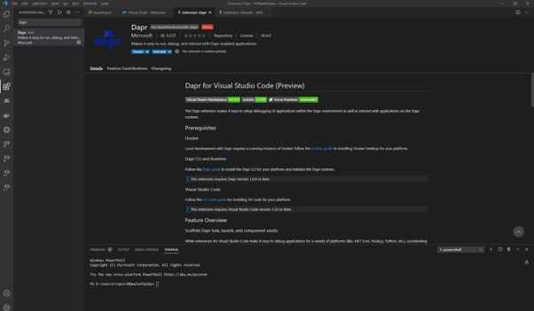

How to set up a dev environment, for later projects (dapr)

Adding dapr:
Run the following command on power shell:
powershell -Command "iwr -useb https://raw.githubusercontent.com/dapr/cli/master/install/install.ps1 | iex"
In case that you get an error regarding permissions run the command that is suggested, that is
Set-ExecutionPolicy RemoteSigned -scope CurrentUser

On command prompt (administrator), run dapr init as per screenshot:


Check the version as per screenshot: 


Verify that containers are running as per screenshot:


Verify that components directory has been initialized as per screenshot:


Run the dapr sidecar, if the windows Defender firewall asks for permission as per screenshot, click on allow access:


Finally, to add Dapr extension to VS Code as per screenshot:



Possible errors to watch for: 

•	Not having GIT installed => solution, install GIT from https://git-scm.com/download/win for windows machine in this case.

•	Getting this error message: 'daprd' is not recognized as an internal or external command, operable program or batch file. To fix this, try restarting the laptop. If it doesn’t work, have a look at the environment variables, maybe set up those is needed.

•	Getting error message in visual studio when the containers are trying to start: 'An attempt was made to access a socket in a way forbidden by its access permissions.' This is down to Hyper-V reserving ports for itself that we're trying to use. To fix this run the following:
```
net stop winnat
netsh int ipv4 add excludedportrange protocol=tcp startport=<yourPortNumber> numberofports=1
net start winnat
```
Run the netsh excludedportrange command for each port you get an error for.